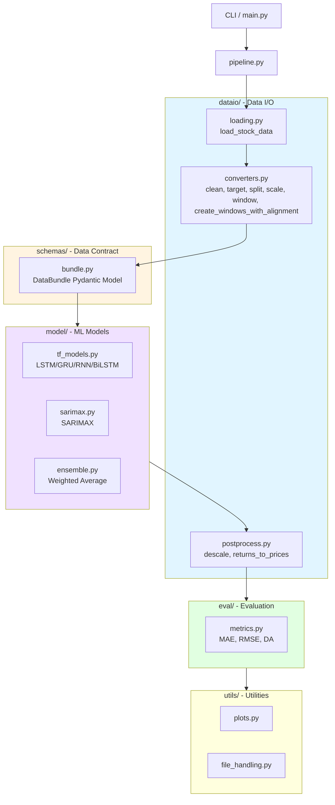
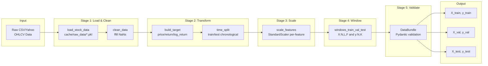
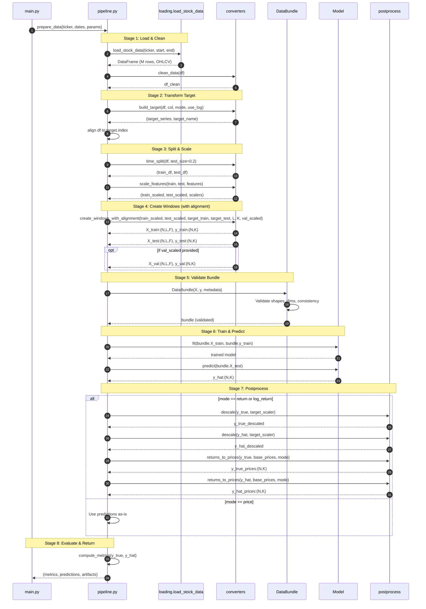

## Glossary (symbols used throughout the code)

### Shape Notation
- **X**: model inputs of shape **(N, L, F)**
  - **N**: number of samples (windows)
  - **L**: lookback length (sequence length) — aliased as `lookback` in code
  - **F**: number of features (automatically inferred from data shape)
- **y**: targets of shape **(N, K)**
  - **K**: forecast horizon (steps ahead) — aliased as `horizon` or `forecast_horizon` in code
- **y_hat**: model predictions of shape **(N, K)**

### Data Modes
- **mode**: target type; one of `"price"` | `"return"` | `"log_return"`
  - `price`: raw price values (no transformation)
  - `return`: simple returns = (p_t - p_{t-1}) / p_{t-1}
  - `log_return`: log returns = log(p_t / p_{t-1})

### Key Variables
- **base_prices_test**: per-sample base price at time t for test rows (shape: N,)
  - Used to convert returns → prices for evaluation
  - Critical for multi-step forecasting
- **DataBundle**: validated Pydantic model carrying all arrays and metadata
  - Enforces shape contracts: X:(N,L,F), y:(N,K)
  - Contains: `lookback=L`, `horizon=K`, `target_mode`, `scalers`

### Loop Variables (Standard Conventions)
- **sample_idx**: index over samples (0 to N-1)
- **step**: index over forecast horizon (0 to K-1)
- **current_price**: running price during return compounding

## Naming Conventions

### Model Interface
- All model classes must implement: `predict(X_test, y_test=None) -> np.ndarray`
  - Returns shape: **(N, K)**
  - `y_test` is optional (for models that need it during prediction)
- No debug prints in production model code (use logging if needed)
- Store all training history/artifacts in model attributes for later access

### Code Quality
- Functions should have single responsibility
- Unused parameters should be removed
- Variable names should be descriptive (avoid single-letter except in standard math contexts)

---

## Component Architecture

### High-Level Overview


---

## Data Flow Pipeline

### Detailed Processing Steps



---

## Function Reference

### dataio/converters.py

#### `clean_data(df, method="ffill") -> DataFrame`
- **Purpose**: Handle missing values
- **Input**: Raw DataFrame with OHLCV columns
- **Output**: Cleaned DataFrame (M', C) where M' <= M
- **Methods**: `"ffill"` (forward-fill) or `"drop"`

#### `build_target(df, target_col, mode, use_log=False) -> (Series, str)`
- **Purpose**: Create target variable based on mode
- **Input**: DataFrame, target column name, mode
- **Output**: (target_series, target_column_name)
- **Modes**:
  - `"price"`: return original prices
  - `"return"`: compute pct_change()
  - `"log_return"`: compute log(p_t / p_{t-1})
- **Note**: Returns drop first row (NaN from diff)

#### `time_split(df, test_size=0.2, val_size=0.0) -> (train_df, test_df, val_df)`
- **Purpose**: Chronological train/test split
- **Input**: Time-indexed DataFrame
- **Output**: (train, test, val) DataFrames
- **Note**: NO shuffling - preserves temporal order

#### `scale_features(train_df, test_df, feature_cols) -> (train_scaled, test_scaled, scalers)`
- **Purpose**: Fit StandardScaler on train, transform both
- **Input**: Train/test DataFrames, feature column names
- **Output**: (train_scaled: (T,F), test_scaled: (Te,F), scalers: dict)
- **Note**: Separate scaler per feature to prevent leakage

#### `window(features_scaled, target_series, lookback, horizon=1) -> (X, y)`
- **Purpose**: Create sliding windows for sequence prediction
- **Input**:
  - `features_scaled`: (M, F) array
  - `target_series`: (M,) array - single target column
  - `lookback`: L - sequence length
  - `horizon`: K - forecast steps (default 1)
- **Output**:
  - `X`: (N, L, F) - N sliding windows
  - `y`: (N, K) - future targets
- **Formula**: N = M - L - K
- **Note**: F is inferred from `features_scaled.shape[1]` - NO feature_cols param needed!

**Example:**
```python
# Create 60-day sequences to predict next 5 days
features = np.random.rand(500, 5)  # 500 days, 5 features
target = np.random.rand(500)        # 500 target values

X, y = window(features, target, lookback=60, horizon=5)
# X.shape = (435, 60, 5)  where 435 = 500 - 60 - 5
# y.shape = (435, 5)
```

---

### dataio/postprocess.py

#### `descale(arr, scaler) -> ndarray`
- **Purpose**: Inverse StandardScaler transformation
- **Input**:
  - `arr`: (N, K) scaled array
  - `scaler`: StandardScaler or None
- **Output**: (N, K) unscaled array
- **Note**: Handles 1D → 2D conversion automatically

#### `to_prices(returns, base_prices, mode, use_log=False, validate=True) -> ndarray`
- **Purpose**: Convert returns → prices using compounding
- **Input**:
  - `returns`: (N, K) return predictions
  - `base_prices`: (N,) base price at time t for each sample
  - `mode`: "price" | "return" | "log_return"
  - `use_log`: whether to use log returns
- **Output**: (N, K) prices
- **Formulas**:
  - Simple return: `price[k] = base * prod(1 + r[0:k+1])`
  - Log return: `price[k] = base * prod(exp(r[0:k+1]))`
- **Variables**:
  - `sample_idx`: iterates over N samples
  - `step`: iterates over K forecast steps
  - `current_price`: running compounded price

**Example:**
```python
returns = np.array([[0.02, 0.01]])  # 2%, 1% returns
base = np.array([100.0])             # base price = 100

prices = to_prices(returns, base, mode="return")
# prices[0, 0] = 100 * (1 + 0.02) = 102.0
# prices[0, 1] = 102 * (1 + 0.01) = 103.02
```

#### `prices_to_returns(prices, base_prices, mode="return", use_log=False) -> ndarray`
- **Purpose**: Inverse of to_prices() - convert prices → returns
- **Input**:
  - `prices`: (N, K) price predictions
  - `base_prices`: (N,) base prices
- **Output**: (N, K) returns
- **Note**: Computes sequential returns: r[k] = (price[k] - price[k-1]) / price[k-1]

---

### dataio/loading.py

#### `load_stock_data(company, start_date, end_date, cache_dir='cache/raw_data') -> DataFrame`
- **Purpose**: Download/cache stock data from Yahoo Finance
- **Input**: Ticker symbol, date range, cache directory
- **Output**: DataFrame with OHLCV columns
- **Caching**: Saves to `{cache_dir}/{ticker}_{start}_to_{end}.pkl`
- **Note**: Flattens MultiIndex columns from yfinance

---

## Model Interface Contract

All models in `dev/model/` must follow this interface:

```python
class ModelInterface:
    """Abstract model interface (not enforced, but conventional)"""

    def fit(self, X_train: np.ndarray, y_train: np.ndarray, **kwargs) -> None:
        """
        Train the model.

        Args:
            X_train: (N, L, F) training sequences
            y_train: (N, K) training targets
            **kwargs: Model-specific parameters
        """
        pass

    def predict(self, X_test: np.ndarray, y_test: Optional[np.ndarray] = None) -> np.ndarray:
        """
        Generate predictions.

        Args:
            X_test: (N_test, L, F) test sequences
            y_test: (N_test, K) optional ground truth (for models that need it)

        Returns:
            y_hat: (N_test, K) predictions
        """
        pass
```

### Model Implementations

#### TFModel (LSTM/GRU/RNN/BiLSTM)
```python
# Located in: dev/model/tf_models.py
model = TFModel(config)
model.fit(X_train, y_train)
y_hat = model.predict(X_test)  # Returns (N, K)
```

#### SARIMAXModel
```python
# Located in: dev/model/sarimax.py
model = SARIMAXModel(forecast_horizon=K)
model.fit(train_df, target_feature="close_return", scalers=scalers)
y_hat = model.predict(X_test)  # Returns (N, K)
```

#### EnsembleModel
```python
# Located in: dev/model/ensemble.py
config = EnsembleConfig(sarima_weight=0.3, lstm_weight=0.7)
ensemble = EnsembleModel(config)
ensemble.fit(sarima_model, lstm_model)  # Pre-trained models
y_hat = ensemble.predict(X_test)  # Weighted average (N, K)
```

---

## DataBundle Schema

The `DataBundle` Pydantic model enforces strict shape contracts:

```python
@dataclass
class DataBundle:
    # Core data
    X_train: NDArray  # (N_train, L, F)
    y_train: NDArray  # (N_train, K)
    X_test: NDArray   # (N_test, L, F)
    y_test: NDArray   # (N_test, K)

    # Metadata
    symbol: str
    features: List[str]  # Length F
    lookback: int        # L
    horizon: int         # K
    target_mode: TargetMode  # PRICE | RETURN | LOG_RETURN
    use_log_returns: bool

    # Scalers
    scalers: Dict[str, StandardScaler]
    target_scaler: Optional[StandardScaler]
    base_prices_test: Optional[NDArray]  # (N_test,)

    # SARIMAX support
    train_df: Optional[DataFrame]
    test_df: Optional[DataFrame]
    target_feature: Optional[str]
```

**Validations enforced:**
- X.ndim == 3, y.ndim == 2
- X.shape[0] == y.shape[0] (sample count match)
- X.shape[1] == lookback
- X.shape[2] == len(features)
- y.shape[1] == horizon
- base_prices_test.shape[0] == X_test.shape[0]
- target_mode consistency with use_log_returns

---

## End-to-End Sequence Diagram



---

## Performance Considerations

### Caching Strategy
```
cache/
  raw_data/           # Yahoo Finance downloads
    CBA.AX_2023-10-10_to_2025-10-10.pkl
  trained_models/     # Saved model weights
    CBA.AX_..._lstm_....keras
```

---

## References

### Key Files
- [pipeline.py](../pipeline.py) - Main orchestration
- [dataio/converters.py](../dataio/converters.py) - Preprocessing
- [dataio/postprocess.py](../dataio/postprocess.py) - Postprocessing
- [schemas/bundle.py](../schemas/bundle.py) - Data contract
- [model/tf_models.py](../model/tf_models.py) - TensorFlow models
- [model/sarimax.py](../model/sarimax.py) - SARIMAX model
- [model/ensemble.py](../model/ensemble.py) - Ensemble model

### External Dependencies
- **yfinance**: Yahoo Finance data download
- **pandas**: DataFrame operations
- **numpy**: Array operations
- **scikit-learn**: StandardScaler, metrics
- **tensorflow/keras**: Deep learning models
- **statsmodels**: SARIMAX implementation
- **pydantic**: Data validation
