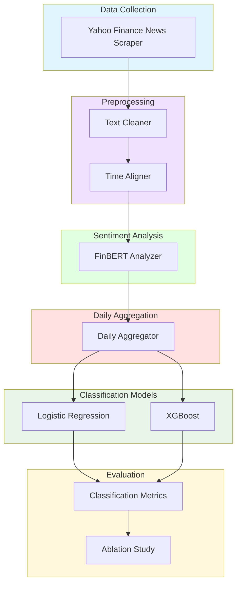
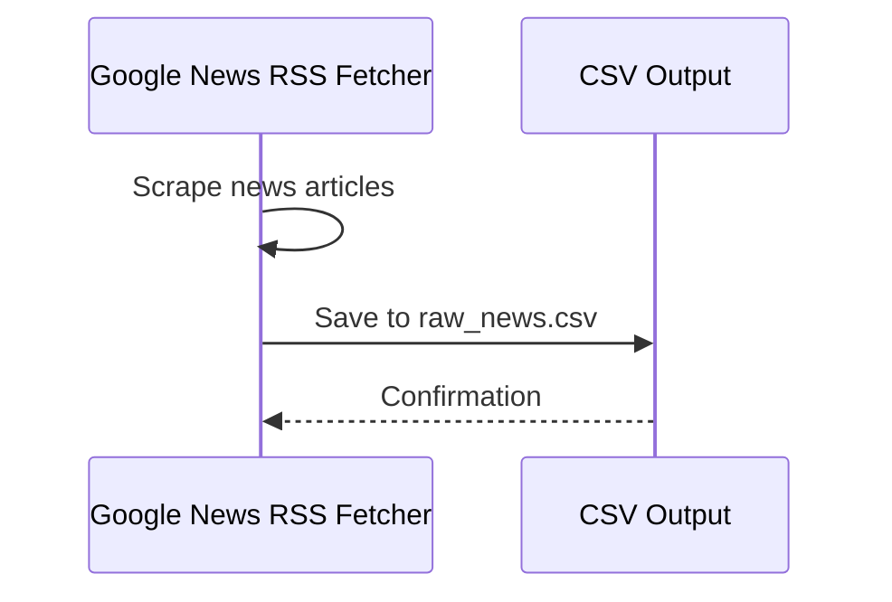
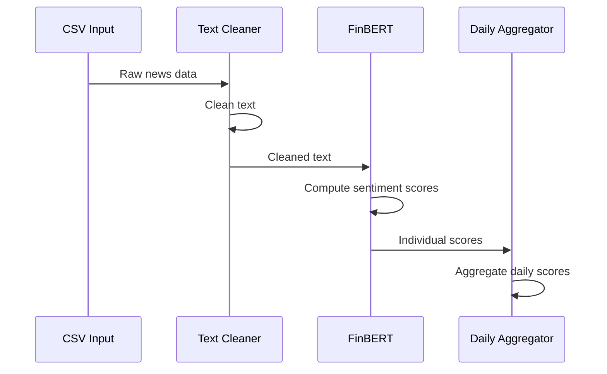
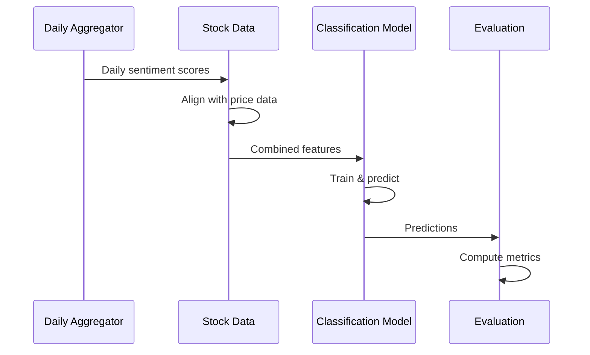

# Sentiment Analysis Architecture for Stock Price Prediction (Lean MVP)

## Overview

This document outlines a lean MVP architecture for incorporating sentiment analysis into the existing stock price prediction system. The focus is on delivering a working solution that meets Task C.7 requirements without over-engineering.

## Architecture Principles

### 1. **Simplicity First**
- Single sentiment source: Google News RSS (company name OR ticker)
- Single sentiment analyzer: FinBERT (ProsusAI)
- Minimal Pydantic validation only where critical
- Clear, verifiable data flow

### 2. **Easy Verification**
- Simple CSV/Parquet outputs for inspection
- Clear temporal alignment (T→T+1, no leakage)
- Ablation study: with/without sentiment features
- Standard classification metrics

### 3. **Integration with Existing Pipeline**
- Extends current DataBundle with optional sentiment features
- Maintains backward compatibility
- Uses existing evaluation framework

## Component Architecture



## Data Flow Pipeline

### Stage 1: Data Collection (Implemented)


### Stage 2: Preprocessing & Sentiment Analysis (Implemented)


### Stage 3: Classification & Evaluation
Note: The current codebase integrates sentiment into the forecasting pipeline (regression) and
plots train/val/test sentiment vs price. The binary classification (Up/Down) pathway is planned
as the next extension (see Next Steps below).


## Pydantic Data Models

### Minimal Sentiment Data Model (target schema)

```python
from pydantic import BaseModel, Field, validator
from datetime import datetime
from typing import Optional

class DailySentimentRow(BaseModel):
    """Daily aggregated sentiment data - single schema for MVP"""
    date: datetime = Field(..., description="Trading date")
    ticker: str = Field(..., description="Stock ticker")
    doc_count: int = Field(..., ge=0, description="Number of news articles")
    s_mean: float = Field(..., description="Mean sentiment score")
    s_median: float = Field(..., description="Median sentiment score")
    s_trim10: float = Field(..., description="10% trimmed mean sentiment")
    pos_ratio: float = Field(..., ge=0.0, le=1.0, description="Ratio of positive articles")
    neg_ratio: float = Field(..., ge=0.0, le=1.0, description="Ratio of negative articles")
    entropy: float = Field(..., ge=0.0, description="Sentiment distribution entropy")
    
    @validator('s_mean', 's_median', 's_trim10')
    def validate_sentiment_scores(cls, v):
        if not -1.0 <= v <= 1.0:
            raise ValueError(f'Sentiment score {v} must be between -1.0 and 1.0')
        return v
    
    @validator('pos_ratio', 'neg_ratio')
    def validate_ratios(cls, v):
        if not 0.0 <= v <= 1.0:
            raise ValueError(f'Ratio {v} must be between 0.0 and 1.0')
        return v

## Data Collection Strategy (Implemented)

### 1. **Google News RSS**
- Query: `"<Company Name> OR <TICKER> after:YYYY-MM-DD before:YYYY-MM-DD"`
- Cached CSV per ticker at `cache/sentiment/<TICKER>_news.csv`
  - On each run, only missing edge ranges are fetched and appended
  - Deduplicate by `url`, then by `title+date`
- Columns: `[date, title, url, source, company, ticker]`

### 2. **Text Preprocessing**
- Minimal cleaning (titles used). Future enhancement: add summary/body when available
- Align to trading days: daily aggregation, then merged into OHLCV before split

## Sentiment Analysis (Implemented)

### 1. **FinBERT (ProsusAI)**
- Single sentiment analyzer for consistency
- Compute probabilities: `p_pos`, `p_neu`, `p_neg`
- Calculate sentiment score: `s = p_pos - p_neg`

### 2. **Daily Aggregation**
- Aggregate per-day: `s_mean`, `s_median`, `s_std`
- Calculate ratios: `pos_ratio`, `neg_ratio`
- Compute `entropy` of sentiment distribution
- Handle missing days via time-aware interpolation; remaining gaps filled with 0

## Forecasting (Implemented) & Classification (Planned)

### Forecasting (Implemented)
- Existing LSTM/GRU/RNN forecasting with sentiment features
- Artifacts: training metrics PNG, predictions PNG, unified train/val/test sentiment-vs-price PNG

### Classification (Planned Next)
- Baseline: Logistic Regression (Up/Down next-day)
- Stronger: Gradient Boosting/XGBoost (if available)
- Metrics: accuracy, precision, recall, F1, confusion matrix, ROC-AUC
- Ablation: without sentiment vs with sentiment

## Evaluation Strategy (Planned for Classification)

### 1. **Standard Metrics**
- Accuracy, Precision, Recall, F1-Score
- Confusion Matrix
- ROC-AUC

### 2. **Ablation Study**
- Compare: with sentiment vs. without sentiment
- This is explicitly required in the rubric
- Clear demonstration of sentiment value

### 3. **Visualizations**
- Daily sentiment vs. next-day return (scatter plot)
- Confusion matrix and ROC curve
- Feature importance plots

## Implementation Plan (Updated)

### Phase 1: Data Collection (Done)
1. **Google News RSS Fetcher + Cache**
   - Append-only cached CSV, dedupe, date-normalized
2. **Text Preprocessing & Alignment**
   - Daily aggregation, gap interpolation, pre-split merge into stock df

### Phase 2: Sentiment Analysis (Done)
1. **FinBERT Integration** (ProsusAI/finbert)
   - Per-article scores → daily metrics (`s_mean`, `s_median`, `s_std`, `pos_ratio`, `neg_ratio`, `entropy`)
2. **Exports** (optional)
   - Daily sentiment parquet/CSV per ticker window (toggleable)

### Phase 3: Forecasting (Done) & Classification (Next)
1. **Forecasting** (Done)
   - LSTM path with sentiment features; metrics & plots saved
2. **Classification** (Next)
   - Build classification pipeline and ablation tooling

### Phase 4: Evaluation & Reporting
1. **Classification Metrics & Ablation** (Next)
   - Accuracy, precision, recall, F1, ROC-AUC, confusion matrix
   - Baseline vs with-sentiment comparison table + deltas
2. **Documentation** (Ongoing)
   - Architecture, data sources (RSS), cache strategy, alignment
   - Visuals: unified sentiment/price plot (train/val/test), metrics plots

## Key Files Structure

```
dev/sentiment/
├── crawl_news.py            # Google News RSS + cache
├── sentiment_analyzer.py    # FinBERT analyzer
├── sentiment_pipeline.py    # Daily aggregation + merge into pipeline
dev/utils/plots.py           # Unified train/val/test sentiment vs price
dev/pipeline.py              # Data prep (with sentiment) + model I/O
dev/main.py                  # CLI; runs training, prediction, and plots
```

## Success Criteria

- ✅ Collect news data for target ticker
- ✅ Generate daily sentiment scores
- ✅ Train classification models
- ✅ Demonstrate sentiment value (ablation study)
- ✅ Generate required visualizations
- ✅ Document results and methodology

## Conclusion

This lean MVP approach focuses on delivering a working sentiment analysis system that meets Task C.7 requirements without over-engineering. The emphasis is on clear data flow, easy verification, and demonstrable results.
